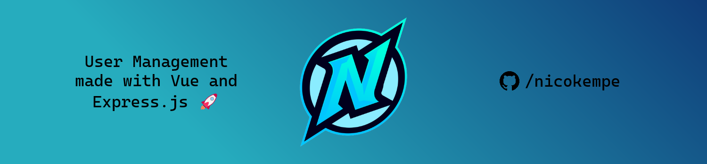

> [!NOTE]
> Highlights information that users should take into account, even when skimming.

> [!TIP]
> Optional information to help a user be more successful.

> [!IMPORTANT]
> Crucial information necessary for users to succeed.

> [!WARNING]
> Critical content demanding immediate user attention due to potential risks.

> [!CAUTION]
> Negative potential consequences of an action.

# test
demo / test project
| Test 1 | Test 2 | Test 3 |
|--------|--------|--------|
| :x:    | :x:    | :x:    |
| :x:    | :x:    | :x:    |

](https://discord.com/invite/t9frQmmqPe))

